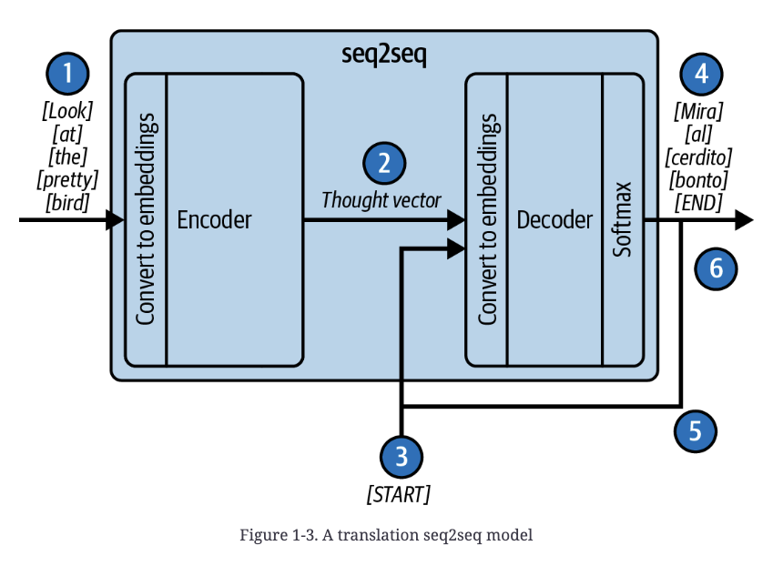
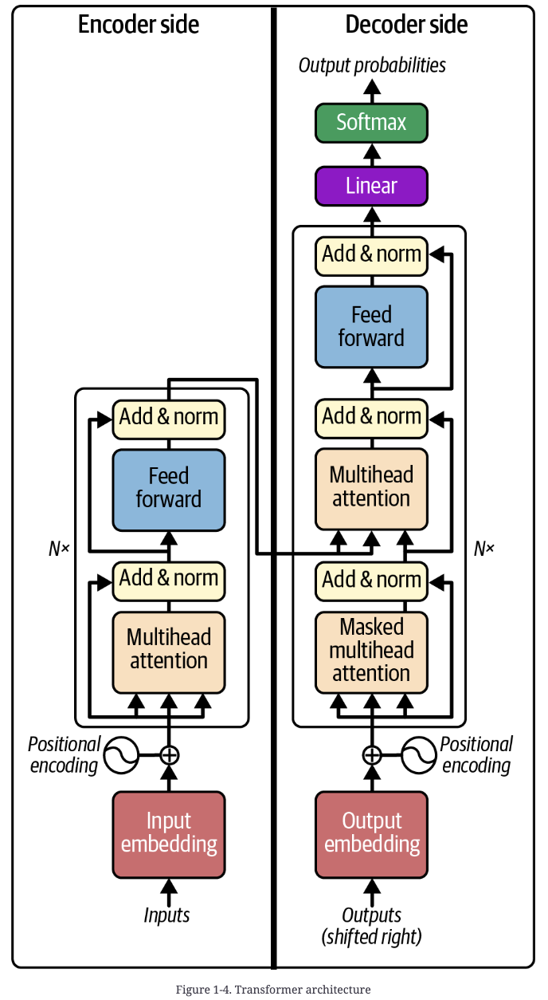

# Ch 1 — Introduction to Prompt Engineering

## Core framing: LLMs are next-token predictors, nothing more

At the core, an LLM does one thing: predict the probability distribution of the next word (token) given a context. That's it. The "magic" of ChatGPT-style interaction is an emergent property of this simple objective applied at sufficient scale, not a fundamentally different mechanism. This matters practically: every capability you'll leverage — chat, tool use, agency — reduces to shaping what text gets completed. Prompt engineering is the discipline of crafting the input (the prompt — a document/block of text) so that its completion contains the information needed to solve the task at hand.

Your phone's next-word suggestion bar is technically the same category of model (a next-token predictor) but not useful — the gap between that and GPT-4 is a story of architecture and scale, not a different kind of task.

## How we got here: the architecture lineage

1. **Markov models (1948)** — earliest language models; still the basis for the phone keyboard's suggestion bar.

2. **Seq2seq (Google, ~2014)** — recurrent neural network with an encoder and decoder. The encoder consumes tokens one at a time, updating a hidden state; when input ends, the final hidden state (the "thought vector") is passed to the decoder, which generates output tokens one at a time, feeding each output back in as the next input, until it emits an END token.
   - **Failure mode — the information bottleneck**: the thought vector is fixed-size and finite. Long inputs get compressed lossily; the decoder "forgets" important context from earlier in a long sequence.

   

3. **Attention mechanism ("Neural Machine Translation by Jointly Learning to Align and Translate," 2015)** — instead of collapsing the encoder's work into one thought vector, preserve *all* per-token hidden states and let the decoder "soft search" over them at each decoding step. Fixed the bottleneck; significantly improved translation quality.

4. **Transformer ("Attention Is All You Need," Google, 2017)** — kept the encoder/decoder high-level structure but ripped out all recurrence, relying entirely on the attention mechanism. Much better at modeling training data than seq2seq, and far more parallelizable (no sequential recurrence to unroll). Trade-off: seq2seq could process arbitrarily long sequences; the transformer is bounded to a fixed, finite context window — a limitation we're still pushing against today (longer context windows, retrieval, etc.).

   

5. **GPT ("Improving Language Understanding by Generative Pre-Training," 2018)** — took the transformer and discarded the encoder entirely, keeping only the decoder side. Not architecturally novel on its own. What was new: the *pretrain-then-fine-tune* pattern — pretrain on massive unlabeled text (self-supervised), then fine-tune for one specific downstream task (classification, similarity, multiple-choice QA, etc.). Crucially, a GPT-1 model was only good at the single task it was fine-tuned for.

6. **GPT-2 (2019)** — simply scaled up GPT-1 by roughly an order of magnitude (117M → 1.5B params; 4.5GB → 40GB training text). This scaling alone produced an unexpected emergent quality: the raw, pretrained model — with no task-specific fine-tuning — could match or beat models that *had* been fine-tuned for that task, across benchmarks like pronoun disambiguation, missing-word prediction, POS tagging, reading comprehension, summarization, translation, and QA. OpenAI initially withheld the full model, citing risks like automated fake news, impersonation, and phishing content generation — concerns that read as more relevant today, not less.

7. **GPT-3 ("Language Models Are Few-Shot Learners," 2020)** — another order-of-magnitude scale-up (175B params, ~499B training tokens). Key discovery: given a handful of task examples in the prompt itself ("few-shot examples"), the model faithfully reproduces the demonstrated pattern and can perform almost any language task, often at high quality — **without any weight updates**. This is the moment prompt engineering was born: task behavior became something you could elicit by modifying the *input*, not by retraining the model.

8. **ChatGPT (Nov 2022, backed by GPT-3.5)** → **GPT-4 (Mar 2023)**, rumored another order of magnitude larger (~1.8T params, ~13T training tokens). Since then: Llama (Meta), Claude (Anthropic), Gemini (Google), and continued acceleration — with comparable quality now reachable in smaller, faster models.

| Model | Released | Params | Training data | Training cost |
|---|---|---|---|---|
| GPT-1 | Jun 2018 | 117M | BookCorpus, 4.5GB | 1.7e19 FLOP |
| GPT-2 | Feb/Nov 2019 | 1.5B | WebText, 40GB / 8M docs | 1.5e21 FLOP |
| GPT-3 | May 2020 | 175B | 499B tokens (Common Crawl, WebText, Wikipedia, books) | 3.1e23 FLOP |
| GPT-3.5 | Mar 2022 | 175B | undisclosed | undisclosed |
| GPT-4 | Mar 2023 | 1.8T (rumored) | ~13T tokens (rumored) | ~2.1e25 FLOP (est.) |

Each generation shows roughly an order-of-magnitude jump in scale paired with a qualitative capability leap — the pattern to watch, not any single model's specs.

## What "prompt engineering" means in this book (four levels of sophistication)

The book's scope goes well beyond wordsmithing a single prompt. Prompt engineering = building the entire LLM-based application: the transformation layer that iteratively and statefully converts real-world user needs into text the LLM can act on, and converts the LLM's text output back into information or action that addresses those needs. The application constructs a pseudodocument, the LLM completes it, and the application parses the completion into a result or action. The science *and art* is making that round-trip translate cleanly across very different domains: the user's problem space and the LLM's document space.

**Level 1 — thin wrapper.** The application does almost nothing beyond passing the user's text through, possibly with light structural formatting (e.g., ChatGPT wrapping a conversation thread in ChatML; early GitHub Copilot just forwarding the current file).

**Level 2 — modify/augment the input.** The application transforms or enriches what the user provided before it reaches the model:
- Transcribing speech to text for a support hotline, then including relevant snippets from past support transcripts/docs.
- Copilot: including relevant snippets from the user's *other open tabs*, not just the current file — because the user had those tabs open for a reason, and the model benefits from that signal.
- Bing chat: pulling in traditional search results so the assistant can discuss events after its training cutoff — this is also a hallucination-reduction technique (grounding via retrieval).
- **Statefulness**: chat applications must reconstruct a prompt that faithfully represents conversation history on every turn. As history grows, avoid overfilling the prompt or including stale/spurious content that distracts the model — techniques include dropping earliest/least-relevant exchanges, or summarizing to compress.

**Level 3 — tool use.** Give the LLM-based application the ability to reach into the real world via API calls — reading external data or creating/modifying real assets. Example: "Send Diane an invitation to a meeting on May 5" requires one tool to resolve "Diane" in the contacts list, another (calendar API) to check availability, then send the invite. Design questions this raises (expanded in Chapter 8): How does the model know which tool to use? How does it invoke the tool correctly? How does the application feed tool results back to the model? How are tool-execution errors handled?

**Level 4 — agency.** The application gives the LLM autonomy to decide *how* to accomplish a broad, user-supplied goal — the frontier, actively being explored (e.g., AutoGPT: give it a goal, it runs a multistep process to gather what it needs). Reality check: unless the goal is tightly constrained, these systems fail more often than they succeed today. Still considered an important direction (covered in Chapters 8–9).

## Practical implication for building LLM applications

Because the model only ever does text completion, every "capability" — conversation, retrieval-grounded answers, tool calls, autonomous agents — is implemented by the *application layer* deciding what text to construct before the call and how to interpret text after it. There is no separate mechanism inside the model for "using a tool" or "remembering a conversation": these are prompt-construction and response-parsing problems wearing different clothes. This is why the book's next chapter goes to LLM text completion mechanics from the API level down to attention, before building up to chat and tool use — because "deep down, it's really all the same thing — text completion" (PDF p. 16).

## Key takeaways

- An LLM's only primitive is next-token prediction; all higher-level behavior (chat, tools, agents) is the application layer shaping prompts and parsing completions around that primitive.
- The architecture path — seq2seq → attention → transformer → GPT (decoder-only) — was driven by fixing an information bottleneck (fixed-size thought vector) and then discovering that scaling a simple pretrain objective produces emergent generalist capability.
- GPT-3's few-shot in-context learning (2020) is the origin point of prompt engineering: task behavior became elicitable via input modification, no weight updates required.
- Each GPT generation is roughly an order-of-magnitude scale-up paired with a qualitative capability jump — and the trend line is accelerating, with frontier-level quality now reachable in smaller/faster models.
- "Prompt engineering" in this book means the full request/response transformation layer of an LLM application, not single-prompt wordsmithing — spanning four levels: thin wrapper, input augmentation/statefulness, tool use, and agency.
- Current agentic (Level 4) systems tend to fail more often than succeed unless the goal is tightly constrained — treat autonomy claims skeptically until scoped.
