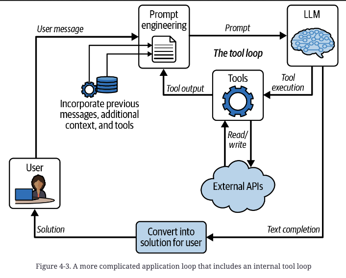

# Ch 4 — Designing LLM Applications

## The application as transformation layer

An LLM application is a transformation layer between the user's problem domain and the
model's text domain. The model does exactly one thing — complete documents. Everything
an "agent" or "chat app" appears to do (write code, book travel, answer support tickets)
is this single capability applied through a loop that translates problem → prompt →
completion → solution.

## The Loop

Core diagram (Figure 4-1): `User problem → [Transform into model domain] → Prompt → LLM
→ Completion → [Transform into solution] → Solution → User`.

The loop cardinality varies by application:
- **Single iteration** — e.g., turning bullet points into email prose. One pass, no
  state retained.
- **Multiple sequential iterations** — e.g., a chat assistant, turn after turn.
- **Iterative with heavy state** — e.g., a travel planner that moves through
  brainstorming → booking → reminders, modifying its own loop shape as the problem
  evolves.

## The user's problem: four dimensions of complexity

| Dimension | Low (proofreading) | Mid (IT support) | High (travel planning) |
|---|---|---|---|
| Medium | Text | Voice over phone | Web UI + text + API interactions |
| Abstraction | Concrete, small, well-defined | Large space, constrained by docs | Subjective taste + objective constraints, coordinated solution |
| Context required | Just the user's text | Docs + example transcripts | Calendars, airline APIs, news, gov travel advisories |
| Statefulness | None — each call is a distinct problem | Must track conversation + solutions tried | Must track weeks of planning across mediums and abandoned branches |

Every LLM application sits somewhere on these four axes; more complex applications need
more elaborate handling on each one.

## Converting the user's problem into the model domain — four criteria

Prompt engineering's crux is satisfying all four simultaneously:

1. **The prompt must closely resemble training-set content** — the *Little Red Riding
   Hood principle*: don't stray from the path the model was trained on. Realistic,
   familiar-looking prompts produce predictable, stable completions. For completion
   models, mimic known document types (code, news articles, markdown docs, homework
   assignments). For chat models, the API already produces a ChatML-like transcript;
   apply the principle inside message content (markdown headers, backticks for code,
   proper grammar — sloppy grammar in the prompt invites sloppy completions).
   - Practical trick: ask the model itself what document types it's familiar with
     (e.g., "What types of formal documents are useful for specifying financial
     information about a company?") to discover patterns worth mimicking.
2. **The prompt must include all information relevant to the problem.** Ranges from
   trivial (proofreading — just the user's raw text) to hard (travel planning — pull
   from calendars, ticket APIs, recent news, government advisories). Two failure modes:
   missing needed content, or saturating the prompt with loosely relevant content that
   distracts the model into irrelevant completions. Content must also be arranged into
   a well-formatted, logical document.
3. **The prompt must lead the model toward a completion that addresses the problem**,
   not just elaborate on it. With completion models this takes deliberate setup (e.g.,
   an explicit "## Solution N" heading, or an example problem/solution pair earlier in
   the prompt establishing voice and pattern). Chat models largely solve this for free
   via fine-tuning — the model is already conditioned to respond helpfully.
4. **The completion must have a natural stopping point.** Chat models stop after the
   assistant turn by default (may still need instructions to control verbosity).
   Completion models need either (a) instructional text establishing that the solution
   should *not* go on forever, or (b) a predictable follow-on pattern combined with the
   `stop` parameter to cut generation the instant that pattern starts (e.g., stop text
   `\n#` to halt right when a new markdown section — a confabulated next problem —
   would begin).

**Cautionary anecdote**: GitHub misconfigured a model to suppress its `<|im_end|>` stop
token. The model, unable to ever stop, kept trying to end politely — it produced a
salutation like "Hope you have a nice day," then, still unable to halt, kept generating
variations swapping in synonyms for *wonderful* one after another until it was finally
cut off by the token limit. Illustrates how much completion-model behavior depends on
stop mechanics working correctly.

## Worked example: travel recommendation prompt (Table 4-2)

A completion-model prompt structured as a fictitious "homework assignment":

```
# Leisure, Travel, and Tourism Studies 101 - Homework Assignment

Provide answers for the following three problems. Each answer should
be concise, no more than a sentence or two.

## Problem 1
What are the top three golf destinations to recommend to customers?
Provide the answer as a short sentence.

## Solution 1
St. Andrews, Scotland; Pebble Beach, California; and Augusta, Georgia,
USA (Augusta National Golf Club) are great destinations for golfing.

## Problem 2
Let's say a customer approaches you to help them with travel plans
for Pyongyang, North Korea.

You check the State Department recommendations, and they advise
against travel due to ongoing risk of arrest and long-term detention
of US nationals, urging increased caution over the threat of wrongful
detention.

You check the recent news and see headlines reporting a North Korean
ballistic missile launch, a multi-day COVID-19 lockdown imposed in
Pyongyang, and renewed diplomatic efforts to address North Korean
human rights concerns.

Please provide the customer with a short recommendation for travel to
their desired destination. What would you tell the customer?

## Solution 2
```
→ Completion (paraphrased): the model advises against North Korea as a destination
right now, but offers to help find a nice alternative in South Korea instead.

How each criterion is satisfied: (1) homework-problem format is common in training
data, written in clean markdown/grammar; (2) direct context (user's destination) plus
indirect context (State Dept advisory, news headlines) is inserted as the bolded/italic
spans; (3) "Problem 1" seeds voice (concise, polite) and pattern (`## Problem N` →
`## Solution N`), and the explicit ask "What would you tell the customer?" points at a
solution rather than more problem elaboration; (4) `\n#` as stop text prevents the model
from confabulating a "Problem 3."

**Chat models simplify (1), (3), (4)** — the chat API's message structure already
matches fine-tuning data, the model is tuned to produce a helpful terminal response, and
it stops after that response. The prompt engineer is still fully responsible for
criterion (2): gathering and shaping all relevant context into the transcript, system
message, and function definitions.

## Choosing and using the model

Model choice trades off three things:
- **Quality vs. cost** — larger models produce higher-quality completions but can cost
  ~20x more (e.g., GPT-4 vs. gpt-3.5-turbo at time of writing). Worth it only sometimes.
- **Latency** — bigger models are slower. GitHub Copilot deliberately chose the smaller,
  faster Codex over GPT-4 because users won't wait for completions, regardless of
  quality.
- **Fine-tuning** — useful when you need information absent from public training data,
  or behavior different from the base model's. GitHub experimented with fine-tuning
  Codex for less-common languages.

## Transforming back to the user domain

Simplest case: hand the raw completion text straight to the user. More often the
completion must be parsed, reformatted, or converted:

- **Structured extraction**: ask the model to emit data in a specific format, then parse
  it (common with plain completion models).
- **Function calling**: the model emits a function-call-shaped completion; the
  application executes the real API (look up flights) and can even take real-world
  action (purchase tickets) — ideally with a user confirmation step in between.
- **Medium change**: text → speech for a phone assistant; text → UI events for a
  graphical app.
- **Presentation change even within text**: Copilot code completions render as
  gray "ghost text" accepted via Tab, while Copilot chat edits render as a red/green
  diff — same underlying model output, different user-domain presentation.

## Zooming into the feedforward pass (Figure 4-2)

Four typical steps for turning the user's problem into a prompt:

1. **Context retrieval** — gather raw text along a direct↔indirect spectrum. Most
   direct: the user's own words. Indirect: nearby relevant sources (open IDE tabs for
   Copilot, doc search results for a support bot). Least direct: boilerplate that
   frames the whole interaction ("This is an IT support request...") and glues the
   direct/indirect pieces into one coherent document.
2. **Snippetization** — break retrieved context into relevance-ranked chunks so it fits
   the token budget; also a format-conversion step (voice→text transcription, JSON→
   natural language so the model doesn't parrot JSON syntax back).
3. **Scoring and prioritizing snippets** — even with today's 100K+ token windows,
   trimming matters because irrelevant text degrades completion quality, not just
   budget. **Priorities** = integer tiers (higher tiers always used before lower ones).
   **Scores** = float-valued fine-grained ranking within a tier.
4. **Prompt assembly** — pack boilerplate + user request + as much supporting context as
   fits, in the correct order, without exceeding the token budget (overflow → API error).
   Techniques for trimming at this stage: elide less-relevant lines of a code file, or
   summarize long documents. Final assembled document must still read like natural
   training data — Little Red Riding Hood again.

## Dimensions of loop complexity

Beyond the basic single-pass feedforward application, complexity grows along four axes:

- **Persisting application state** — anything beyond one-shot (e.g., Copilot code
  completion, which is fully stateless) needs a stored record. A chat app must look up
  and replay conversation history each turn. Long-running interactions may need
  truncation (cut oldest turns) or summarization (compress older turns) to keep history
  within budget.
- **External context (RAG)** — models only know their training data; they have no
  access to recent events or private/corporate/personal information. Retrieval-augmented
  generation supplies this at request time. Indexing can use embedding models + a vector
  store (e.g., Pinecone) or a traditional search index (e.g., Elasticsearch) — the
  latter is often simpler to manage and debug. Retrieval strategies range from
  using the raw user query as the search query, to having the LLM generate a cleaner
  search query itself, to giving the model a *search tool* it invokes only when it
  judges retrieval is actually needed (avoids searching on every turn of an ongoing chat).
- **Increasing reasoning depth** — larger LLMs (starting around GPT-2) generalize far
  beyond narrow training tasks ("Language Models are Unsupervised Multitask Learners");
  e.g., appending `TL;DR` elicits summarization, one example pair elicits translation.
  **Chain-of-thought**: since a model has no internal monologue, it can only "think"
  by writing tokens out loud before the answer — insisting on visible step-by-step
  reasoning before the final answer measurably improves results, because later tokens
  are generated consistent with the earlier "thoughts."
- **Tool usage (Figure 4-3, "the tool loop")** — LLMs are closed-world by default: no
  knowledge of or effect on the outside world. Tools (name + arguments + description)
  let the model request actions; the *application*, not the model, actually executes
  them against external APIs and feeds results back into the prompt for further
  reasoning. The ReAct paper ("ReAct: Synergizing Reasoning and Acting in Language
  Models," 2022) is an early example, introducing `search`, `lookup`, and `finish`
  tools over Wikipedia — showing tool use and RAG overlap (a search tool lets the model
  decide for itself when and what to retrieve). Read-only tools (search, weather,
  email-check) are safe; write tools (create PRs, book travel, purchase tickets) need
  real guardrails — models are probabilistic and do make mistakes, so don't let an
  application book a trip just because a user mused about visiting "someday."

  

  The tool loop nests inside the outer application loop: the model receives the prompt
  plus tool definitions, may emit a tool call instead of (or before) a final answer, the
  application executes that call against a real external API, and the result is folded
  back into the prompt so the model can reason further — repeating until the model
  produces a final text completion that gets converted into the user's solution.

## Evaluating LLM application quality

Two complementary tracks — evaluation should be constant, not a one-time gate.

**Offline evaluation** — testing before real users are exposed. Harder than online eval
because there's no real "good/bad" signal yet; you need a simulated proxy.
- Good-proxy example: Copilot code completions — delete a fragment of working code,
  regenerate it, and check whether tests still pass. Cheap, objective, scalable.
- Harder cases (open-ended chat, scheduling assistants): emerging approach is
  **LLM-as-judge** — have a model review transcripts and rank/score variants, either
  with a simple "which is better?" prompt or a detailed checklist for nuanced scoring.
- Engage as much of the real application pipeline as possible during eval; faking the
  context-gathering step is tempting but risks missing exactly the failures that matter
  most in production.

**Online evaluation** — real user feedback in production, via telemetry ("measure
everything").
- Explicit feedback (thumbs up/down) is easy to add but biased — often only very
  dissatisfied users bother to vote, and overall response rates are low.
- Implicit signals are usually more reliable but need careful interpretation. Copilot
  uses completion **acceptance rate** as its primary metric because it was found to
  correlate most strongly with actual user productivity gains — chosen deliberately over
  a naive metric like session length, which is ambiguous (short sessions could mean
  efficient task completion or user abandonment/frustration).
- General principle: pick a metric that demonstrates real productivity/value for users,
  not just an easy-to-measure proxy for engagement.

## Key takeaways

- An LLM application is a transformation layer, not the model itself — all the
  engineering work is in converting user problem ↔ model text domain and back.
- Every prompt must simultaneously satisfy four criteria: resemble training data
  (Little Red Riding Hood), carry all relevant information, steer toward an actual
  solution, and have a clean stopping mechanism.
- Chat models solve three of the four criteria almost for free (format matching,
  helpful completion, natural stop) via fine-tuning — but context-gathering
  (criterion 2) is never automatic and remains entirely the engineer's job.
- The feedforward pass decomposes into retrieval → snippetization → scoring/prioritizing
  → assembly; complexity beyond that grows along four independent axes: state, external
  context (RAG), reasoning depth (chain-of-thought), and tool use.
- Tools let models act in a closed world only through application-mediated execution —
  read tools are low-risk, write/action tools need explicit safeguards since models are
  probabilistic and fallible.
- Evaluate continuously, both offline (simulated proxies, LLM-as-judge before shipping)
  and online (telemetry, chosen implicit metrics tied to real user productivity) — don't
  rely on sparse explicit feedback alone.
