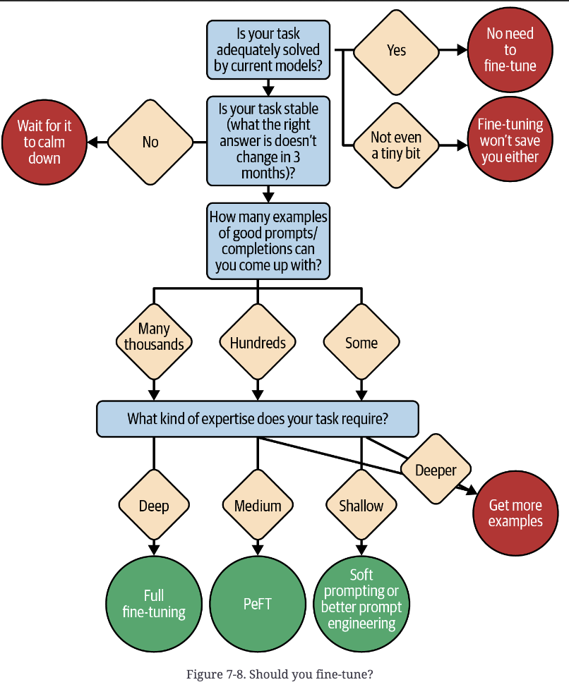

# Ch 7 — Taming the Model

## Anatomy of the ideal completion

A completion has four parts: preamble, relevant solution, recognizable end, fluffy
postscript. Length matters before the solution (every preamble token costs latency and
money) and is irrelevant after the recognizable end (once you can parse out the answer,
trailing fluff can be discarded cheaply — though it still costs generation time unless
you cut generation short).

## The preamble: three types

1. **Structural boilerplate** — the transition text between prompt and completion
   (e.g., an opening bracket). Push this into the *prompt* rather than letting the model
   generate it: cheaper, faster, and guarantees format adherence.
2. **Reasoning** — chain-of-thought or clarifying restatement of the question. This is a
   preamble you *want* long. A long reasoning preamble is a virtue, not a cost, when it
   improves the final answer's correctness — the book's number-guessing example shows the
   model getting the wrong answer with a short preamble (`{4, 6, 8, 9}`) and the right one
   after being forced to reason step by step first (`{6, 10}`).
3. **Fluff** — RLHF-trained models default to verbose, polite, hedge-y text
   (disclaimers, apologies, background explanation) that's costly for programmatic
   use. Fixes:
   - Few-shot examples showing the exact desired format.
   - Explicit instructions (e.g., telling the model not to acknowledge that this is a
     new answer) — but models sometimes ignore these under RLHF pull toward politeness.
   - **Reformat so fluff is parseable, not eliminated.** Instead of fighting the model to
     suppress commentary, give it a numbered slot for it: `1. [answers] 2. [disclaimers]
     3. [background]`. The model still produces the fluff, but now it's in a
     predictable, skippable location instead of contaminating the main answer. Note this
     doesn't always kill a short intro before the first list item — some fluff resists
     even this trick.

## Recognizable start and end

You need to programmatically detect where the real answer begins and ends. Whether "end"
can be tested as a simple substring search depends on document structure:

| Structure | Start | End | End = substring test? |
|---|---|---|---|
| Markdown | expected header | any other section header | Yes |
| YAML | expected keyword after newline | line with lower indentation | No |
| JSON | keyword in quotes + colon + quote | any unescaped quote | No |
| Triple-ticked code | \`\`\`[lang]\n | \n\`\`\`\n | Yes |
| First numbered list item | `1.` | `2.` | Yes |
| Function/class (braced lang) | `{` | matching `}` | No |
| Function/class (indented lang) | header | lower indentation | No |

You can sharpen these heuristics with domain knowledge — e.g., in YAML, look for lower
indentation *followed by the specific next keyword you expect*, not just any dedent.

## Stopping generation early

A recognizable end isn't just for parsing — use it to cut generation short and save
latency/cost:
- **Stop sequences**: pass strings to the API; generation halts server-side the instant
  one is hit. Zero cost for anything after. Preferred when available.
- **Streaming + cancellation**: tokens arrive incrementally so you can detect the end and
  cancel, but network round-trip delay means some waste is unavoidable — less effective
  than stop sequences.
- Tip: stop sequences should usually include a leading `\n` (e.g. `\n#`) or they'll
  false-trigger on a `#` inside a code comment or phone number.
- Tip: you can add *likely* (not just guaranteed) continuation markers as extra stop
  sequences — e.g. `\nclass`, `\ndef`, `\nif` after a Python class, since methods are
  indented and won't start with `\n` at column 0, so they're safe to use as stops.

## Logprobs: reading the model's confidence

Logprobs are the log-probability of each token the model considered. 0 = certainty; more
negative = less likely. Convert to probability with `exp()`. Available via the API
(`echo=true` also returns logprobs for the *prompt*, not just the completion) — but some
commercial providers disable this to prevent reverse-engineering, so check availability
before designing around it.

### Answer-quality signal
Average the logprobs across the completion (sum / token count) as a rough confidence
score. GitHub Copilot found averaging raw *probabilities* of early tokens
(`(exp(logprob_1) + ... + exp(logprob_n)) / n`) more predictive of completion quality
than averaging logprobs directly. Use the score to gate behavior:
- Only show corrections/suggestions above a confidence threshold.
- Surface a warning when confidence is unusually low.
- Auto-retry or add context when the model struggles.
- Escalate to a stronger, pricier model.
- Only interrupt the user when certainty is high — "Remember Clippy? Don't be like
  Clippy." (PDF p. 9)

For more reliability at higher cost: raise temperature, generate `n` completions, pick
the one with the best average logprob. Rule of thumb: `temperature ≈ sqrt(n) / 10`, else
with n>1 and temp=0 all completions are identical.

### Classification via logprobs
LLMs are generative, not natively classifiers, but for tasks resting on public
knowledge/common sense they classify well if you constrain the prompt: ask for the
answer in a fixed format like `1. [negative | positive | neutral] 2. [explanation]`,
where `1.` is a recognizable start immediately followed by the decision token.

**Critical pitfall — token prefix collision.** If two candidate labels share a leading
token (e.g., "North America" and "Northeast Asia" both start with the token `North`),
the model's probability mass for that shared prefix token is the *sum* of both
options' likelihoods. A low-confidence model defaults to whichever prefix is shared,
even if the specific completion it would pick after committing to that prefix is worse
than a third, unambiguous option. Concrete example from the book (real GPT-3.5-turbo-instruct
probabilities): "Europe" scores 44% as a first token and is the actual best answer, but
"North" (shared by North America 55%×76%=42% and Northeast Asia 55%×23%=13%) wins the
first-token race at 55% combined — so the model's greedy output becomes "Northeast Asia,"
which is *worse* than either the true top option or a naive reading would suggest.
**Fix: make every candidate label start with a distinct token.**

**Calibration.** The model's raw confidence threshold rarely matches your application's
desired threshold (e.g., deciding whether an email is professional enough — the model's
sense of "yes" doesn't line up with your bar). Calibration = shifting logprobs by a constant per
token (`a_tok`) before comparing them, e.g. add 0.3 to the logprob of "Yes" before
comparing to "No" to make the classifier more lenient. Find the constants by
experimentation or by fitting logistic regression / minimizing cross-entropy loss
against labeled ground truth. Many providers expose this natively as **logit bias** so
you don't have to touch raw logprobs yourself.

### Critical points in the prompt
Setting `echo=true` returns logprobs for the *input* text too, not just completion —
useful even with zero completion tokens requested. Surprising (low-logprob, e.g. below
-13) tokens flag typos or otherwise unexpected content in your own prompt — the book
demonstrates catching "completion" mis-typed as "compl+ution" this way. More generally,
use logprob dips to detect high-information-density passages and direct app or user
attention there. Rough heuristic bands: single-digit-negative logprobs are common/normal;
double-digit-negative ones usually flag genuine weirdness — but there's no universal
threshold, and it varies by model, genre, and even *within* a single text (logprobs run
lower at the start of a text, before topic/style is established, and rise as the model
gets more context). Logprobs are also not deterministic — float rounding can shift them
by ±1 across runs, so tests must tolerate variation or mock the model.

## Choosing the model

No single best model — trade-offs are per-project. Ranked considerations for most
scenarios:

1. **Intelligence** — how close to an expert human on hard reasoning/accuracy tasks.
2. **Speed** — latency tolerance depends on interaction style (sync chat vs. batch job).
3. **Cost** — per-inference cost, critical at high request volume.
4. **Ease of use** — how much GPU provisioning, deployment, caching, routing is handled
   for you vs. DIY.
5. **Functionality** — instruct/chat/tool-use support, logprob exposure, multimodal
   (image) input.
6. **Special requirements** — open source, noncommercial, specific training data, data
   residency, on-prem/no-logging. Nonnegotiable for some, irrelevant for others.

These trade off against each other, not independently (visualized in the book as a
smart/easy/fast/cheap trade-off diagram): tightening one constraint narrows the field on
the others. E.g., high-volume simple requests → cheap small model; low-volume solo
project → splurge on premium since cost barely matters at that scale; super cheap AND
super smart is not obtainable — the book notes these two sit at opposite ends of the
spectrum (PDF p. 17).

Provider landscape as of the book's writing (2024, expect staleness): OpenAI was the
early dominant full-service choice; Anthropic emphasizes alignment/safety (Claude 3.5
Sonnet topped several benchmarks); Mistral specializes in efficient open-weight models;
Cohere is popular for RAG; Google leverages ecosystem integration; Meta ships large
open-access models. Don't hard-bake a model choice into your code — use an abstraction
layer (e.g., LiteLLM) so you can swap later. Prototype with a slightly bigger/pricier
model than you think you can afford — flagship prices fall over time, so by public launch
a better tier is often affordable, and your prompt engineering will already be tuned
for it.

## Fine-tuning: prompt engineering by other means

Three escalating levels of "teaching the model your task," summarized by data volume and
what's actually learned. How many training examples you can realistically gather is the
key decision input (PDF pp. 19–20):

| Approach | Learns | Needs (examples) | Time |
|---|---|---|---|
| Full fine-tuning / continued pre-training | New facts, whole new domain | Tens of thousands | Weeks–months |
| Parameter-efficient (e.g., LoRA) | Prior expectations within an existing domain, fixed format/interpretation | Hundreds–thousands | Days |
| Soft prompting | Whatever's in a static prompt | Hundreds | Hours |

**Full fine-tuning / continued pre-training**: continue the original training process on
new documents; every parameter shifts. Analogy: not explaining a concept to a human, but
carving a riverbed — thousands of documents slowly wear a new groove. Can teach genuinely
new facts/domains, but is the most expensive and slowest option.

**LoRA (low-rank adaptation)**: parameter-efficient — trains a small low-rank "diff"
matrix added to a few key weight matrices instead of touching all parameters. Cheap to
store/share (diffs are small; one base deployment can host many diffs), fast (hours to
days). LoRA doesn't teach new tricks — it teaches the model *which* of its existing
tricks to use, on what to pay attention to in the prompt, and what output is expected.
Also excels at shifting the model's implicit prior distribution — the book's example
(PDF p. 21): a European travel app can either state in every prompt that the customer is
European, or LoRA-bake that assumption in, and LoRA additionally captures priors you can't easily articulate
(e.g., telemetry showing budget-conscious users reject "Monaco" but buy tickets after
"Prague" suggestions) by conditioning on real outcome data rather than an explicit rule.

**Soft prompting**: rather than hand-crafting prompt wording to put the model in the
right "state of mind," use gradient descent over a few dozen example outputs to find an
input embedding that reliably induces that state — cheapest and fastest, but requires
framework support (many don't offer it).

With continued pre-training or LoRA, you can typically drop *all* static prompt context
— explanations, instructions, few-shot examples — since the model absorbs them into
parameters directly (and more effectively than the same content presented at inference
time). **Fine-tuning is prompt engineering by other means.**

**Modified Little Red Riding Hood principle for fine-tuned models**: the model now has
two viable "paths" it can pattern-match onto — its original pretraining distribution and
your fine-tuned distribution. If your prompt happens to resemble the *original* training
data's shape more than your fine-tuning documents' shape, the model will follow the old
path and effectively forget its fine-tuning. So: (1) make the prompt look like the start
of one of your fine-tuning documents, and (2) make sure it does *not* accidentally
resemble one of the original pretraining documents.

## Key takeaways

- Structure completions deliberately: push boilerplate into the prompt, let reasoning
  preambles run long when they improve correctness, and give fluff a designated,
  parseable slot rather than fighting to eliminate it.
- Use stop sequences (preferred) or streaming+cancellation to end generation exactly at
  your recognizable end — every token past that point is pure waste.
- Logprobs turn the model from a black box into an instrument: average them for a
  quality/confidence score, use them for calibrated classification (watch for
  shared-token-prefix collisions across candidate labels), and use `echo=true` to spot
  surprising/high-density spots in your own prompt.
- Model choice is a multi-axis trade-off (intelligence, speed, cost, ease of use,
  functionality, special requirements) — tightening one constraint narrows the others;
  don't hard-code the choice into your app.
- Fine-tuning is a continuum, not a binary: full fine-tuning teaches new facts/domains,
  LoRA teaches the model which existing tricks to apply and calibrates its priors, soft
  prompting bakes in a static prompt's content — and all three still obey a modified
  Little Red Riding Hood principle where the prompt's shape determines which learned
  path (original vs. fine-tuned) the model follows.
