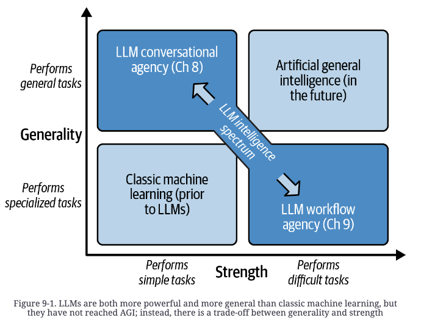

# Ch 9 — LLM Workflows

> Cross-pillar: this chapter's content maps to [04-loop](../../04-loop/README.md) (agentic loops and workflow orchestration); it lives here because the book is filed under 01-prompt.

## The generality/strength trade-off

Current LLMs are far from AGI: they're bad at reasoning and math, rarely produce genuinely novel knowledge, and can't learn outside training. Future AGI needs both **strength** (solving complex problems) and **generality** (solving them in any domain) — today's models trade one for the other.



A pure conversational agent (Ch 8) sits at the general/weak corner: it'll talk about anything but won't reliably execute multi-step work. Narrowing its system message and tools toward one domain buys strength at the cost of generality. **Workflows** push further in that direction: decompose a large task into small, well-defined subtasks executed with high fidelity, coordinated by a supervisor process (LLM-driven or not). A workflow isn't built to handle arbitrary user requests — it's built for one job, and it does that job better than a general agent would.

## Why conversational agents break down on complex tasks

Worked example: an LLM app that scrapes Shopify storefronts, invents a plug-in idea per store, and emails the owner a pitch (a real stunt someone pulled off in 2023 — thousands of cold emails, some genuinely good ideas like a "Sock-cess Stories" UGC plug-in for a sock store).

Pushing a conversational agent at this task degrades predictably as you try to fix it:
- **No tools, open system message** ("you can do anything"): the model just narrates a hypothetical plan instead of doing the work.
- **Add tools** (`search_web`, `browse_site`, `send_email`): narrows the domain but the agent's approach stays naive — generic web search, terse plug-in ideas, form-letter emails with literal `[your_name]` placeholders.
- **Move instructions into the system message, add task-specific tools**: the base prompt grows large and complex, which distracts and confuses the model as the task lengthens.
- **Fundamental gaps remain**: no clean way to process units of work (dump everything at once → disaster; one at a time → you need a queue, i.e., you're already building infrastructure beyond a conversational agent); and when a step fails, the system message amounts to little more than a strong suggestion — no real correction mechanism.

Conclusion: isolate each step as its own specialized task and assemble the set into a workflow.

## Building a basic workflow — 5 steps

1. **Define goal** — the desired output/change the workflow should produce.
2. **Specify tasks** — break the goal into ordered tasks; identify each task's tools, inputs, and outputs.
3. **Implement tasks** — build each task so it works correctly in isolation, with clearly defined I/O.
4. **Implement workflow** — connect tasks; adjust as needed so they function correctly together.
5. **Optimize workflow** — improve quality, performance, cost.

Workflows are appealing because they're **modular**: decomposing a complex problem into components makes it easier to build, and when something breaks, easier to isolate and fix.

### Specifying tasks: I/O contracts matter more than internals

Since tasks feed each other, each one needs a well-defined input/output schema — structured or free-form, and if structured, with an explicit schema. Example from the Shopify workflow (email generation task):

**Input** (plug-in concept):
| Field | Type | Content |
|---|---|---|
| `name` | Text | Plug-in name |
| `concept` | Text | Basic idea |
| `rationale` | Text | Why it's a good idea |
| `store_id` | Uuid | Lookup key for store details |

**Output** (email):
| Field | Type | Content |
|---|---|---|
| `subject_line` | Text | Email subject |
| `body` | Text | Email body |

The *how* of a task (its internal prompting/logic) doesn't need to be as rigidly nailed down as the interface — content is easy to iterate on, but changing the I/O schema forces you back to rearranging tasks. Still, define *how* clearly enough that you're confident it's a reasonable task before implementation, or you'll end up back at the drawing board.

## Implementing LLM-based tasks

First question: **does this task need an LLM at all?** If it can be done with traditional software (a web crawler for scraping) or a lighter ML model (a BERT classifier for classification-only tasks), do that instead — LLMs are expensive, slow, nondeterministic, and less dependable. Reserve LLM usage for where it's actually needed.

### Templated prompt approach

Build a prompt template per task (this is LangChain's core "chain" abstraction: each link fills a template from inputs, then parses the completion into outputs). Example prefix/suffix framing for a completion model generating a marketing email:

```
# Research and Proposal Document
JivePlug-ins creates delightful and profitable Shopify plug-ins.
This document presents research about {storefront.name}, our
plug-in concept "{plugin.name}", and an email sent to the store
owner {storefront.owner_name}.

## Store Website Details
{storefront.details}

## Plug-in Concept
{plugin.description}

## Proposal to Storefront Owner
Dear {storefront.owner_name},
--- suffix ---
We hope to hear from you soon,
JivePlug-ins
```

The prefix/suffix bracketing (`Dear {owner_name}` ... `We hope to hear from you soon,`) constrains the completion so it's *exactly* the email body and nothing else — no post-processing needed to strip preamble. Treat this as a first draft: iterate on tone/specificity after seeing real completions.

### Tool-based approach (structured extraction)

For tasks that pull structured content out of free-form input (e.g., extract name/address/phone from scraped restaurant HTML), define a tool the model must call:

```json
{
  "type": "function",
  "function": {
    "name": "saveRestaurantDataToDatabase",
    "description": "Saves restaurant information to the database.",
    "parameters": {
      "type": "object",
      "properties": {
        "name": {"type": "string", "description": "The name of the restaurant"},
        "address": {"type": "string", "description": "The address of the restaurant"},
        "phoneNumber": {"type": "string", "description": "The phone number of the restaurant"}
      },
      "required": ["name"]
    }
  }
}
```

There's no real database — the tool call is just a forcing function to get structured output. With OpenAI models, force the call via `tool_choice: {"type": "function", "function": {"name": "..."}}`; structured-outputs support further guarantees the shape.

**Debugging failed extraction**: two likely causes. (1) The source content itself is hard to parse — if a human can't pick it out reliably, neither can the model; clean up/simplify the prompt. (2) The target structure is too complex (many keys, nested objects, nullable fields) — break it into smaller pieces tackled one at a time; this also lets you give more specific extraction instructions per piece.

### Adding sophistication when quality is insufficient

- **Chain-of-thought / ReAct** (Ch 8): let the model reason out loud before acting or answering. If it jumps to tool calls too fast, disable tool execution for one turn (`tool_choice: "none"` in OpenAI's API, but keep tool *specs* in the request so the model reasons about what it has available) to force a planning pass first. Claude Opus does CoT by default; Sonnet/Haiku need it prompted.
- **Reflexion**: run the task via any prompting method (the original paper uses ReAct), then have the application layer analyze the output against requirements — a formatting check, compiling/testing code, or an LLM-as-judge review. If the analysis finds the output insufficient, construct a follow-up prompt containing the requirements, the failed attempt, and the critique, and ask the model to retry. Improves reliability at the cost of significantly more compute — apply only when straightforward prompt tightening isn't enough.
- **Conversational sub-agents** (experimental, for open-ended tasks): spin up an "expert" conversational agent for the task plus a "user proxy" agent that drives it toward the goal (see AutoGen). Heavier-weight; reach for this only when the task doesn't decompose cleanly into a fixed prompt or tool call.

### Task-level engineering hygiene

- Mix implementation types freely: LLM tasks, plain code (web crawling), mechanical steps (DB writes), or non-LLM ML (BERT classifiers) can coexist in one workflow.
- Insert **human-in-the-loop** checkpoints for expensive/irreversible actions (approval gates) or for judgment calls on output quality; for Reflexion tasks that keep failing, route to a human to inspect and adjust the prompt.
- Don't force one LLM across all tasks — cheap self-hosted models for easy tasks, frontier models for hard tasks, fine-tuned in-house models for highly customized tasks.
- **Evaluate at the task level before evaluating the whole workflow.** Modularity means a break usually traces to one faulty task — think through failure modes and recovery per task up front (full evaluation techniques covered in Ch 10).

## Assembling the workflow: topologies

A workflow is tasks connected by data flow; can be conceptualized as a state machine, a pub-sub network, or an orchestrator-managed graph — functionally equivalent, differing only in interconnection style.

- **Pipeline** — tasks connected sequentially, each task's output feeding into at most one next task. Simplest, but rigid: information not explicitly passed through gets lost to downstream tasks. In the Shopify example, storefront details extracted early aren't available to the email composer unless threaded through the plug-in generator — an unintuitive coupling.
- **DAG (directed acyclic graph)** — a task can fan out to multiple downstream tasks or take input from multiple upstream tasks, as long as there are no cycles. Fixes the pipeline's coupling problem (storefront details go directly to *both* the concept generator and the email composer). DAGs are the standard for workflow automation (Airflow, Luigi) because dependency reasoning stays simple: a task runs once all its upstream dependencies complete.
- **Cyclic graph** — information can loop back to upstream tasks, e.g., a quality-control step routes failed emails back to "extract details" for another attempt. Sometimes necessary for LLM workflows (retry after a model mistake), but adds real complexity: failure-context data must be reunited with the original work item on the loop-back, every downstream task must now anticipate failure-annotated work items, and you need an attempt counter with a give-up threshold to prevent infinite cycling. Prefer hiding any needed recursion *inside* a task rather than hoisting the cyclic dependency up to the workflow level.

**Batch vs. streaming**: batch processes a known, finite set of work items (simpler, better for large volume); streaming processes an open-ended, arriving set (needed for low-latency/real-time use, more complex to build).

## Worked example: Shopify plug-in promoter (DAG)

Final task breakdown: *emit storefront HTML* (mocked, reads from filesystem) → *summarize storefront* (LLM: what do they sell, tone, values, themes, anything praiseworthy, anything else noteworthy) → *generate plug-in concept* (two-step: brainstorm several options via CoT, then produce a clean report on the single best one — the two-step split keeps the CoT scratch work out of the retained output) → *generate email* (three-step: devise a promotion strategy via CoT, generate subject line, generate body) → *send email* (mocked, prints to screen). Wired as a DAG so storefront details reach both the concept generator and the email composer directly.

**Optimization pass after building**: check the tasks are even the *correct* ones (the book's own run produced repetitive ideas — lots of virtual try-on plug-ins, lots of impact trackers — suggesting the brainstorming step needs more diversity pressure and steering away from common patterns); add a feasibility-check subprocess since not every generated idea is implementable; add corrective feedback either at task level (Reflexion) or workflow level (route failed work items back to the start with failure context). Once tasks are stable, start collecting I/O examples per task to build an offline test harness (catches prompt regressions before shipping changes) and to feed emerging prompt-optimization frameworks (DSPy, TextGrad) that auto-tune prompts against a metric. In production, sample real I/O traffic to watch for quality drift and to run live A/B tests between competing task implementations.

## Advanced LLM workflows (frontier, less stable)

Basic workflows use a fixed, known set of tasks in a fixed connection pattern — traditional pipeline/DAG/graph routing, no LLM involved in the routing itself. Advanced workflows put an LLM in charge of the *routing*, trading stability for flexibility:

- **LLM agent drives the workflow** — the workflow itself becomes a conversational agent whose tools are the available tasks; it chooses which task handles each new piece of work. Escalate further: make the tasks themselves conversational agents too (an "agent of agents") — give each a `finish` tool so nested agents can submit a definite output instead of chatting indefinitely (see the ReAct paper). Push furthest: let the workflow agent *generate* tasks on the fly — crafting a system message and selecting tools from a large pool per newly identified need — and manage a growing, continually reprioritized work list rather than processing one task at a time.
- **Stateful task agents** — instead of stateless tasks that start fresh per work item, each task is a persistent agent bound to a work item (e.g., one agent per source file in a "build a website" workflow), responsible for keeping its file consistent as related files change. Task agents notify dependent agents on change (or a workflow orchestrator mediates); watch for circular dependencies, which can prevent the workflow from ever reaching a stopping point. Bonus: because agents are stateful, users/developers can converse directly with the agent owning a given asset instead of editing files by hand.
- **Roles and delegation** — assign agents specific roles and delegate as if assembling a team. AutoGen's base pattern: an **Assistant** (standard conversational agent, Ch 8 design) paired with a **UserProxy** (stands in for the human, holds the goal, keeps the Assistant on track, declares success) — effectively a minimal two-agent workflow. AutoGen also offers a **group chat manager** that coordinates several role-specific agents, delegating each incoming request. CrewAI fills a similar niche with named "crews," each agent given a role/goal/backstory/tools, coordinated via `sequential` (pipeline), `hierarchical` (manager delegates, like AutoGen's group chat manager), or `consensual` (peer negotiation — still unreleased at time of writing) processes.

**Try-it exercise from the book**: build a UserProxy/Assistant pair from scratch (no framework) for a concrete goal — e.g., a command-line Python math tutor. Give one agent the `CodeAssistant` role with file-write/test-run tools but *no* knowledge of the overall goal; give the other a `UserProxy` role with no tools but a system message stating the goal clearly. Put them in conversation and observe: do they converge, get distracted, or spiral into empty "thanks again!" pleasantries? Tune system messages and tooling and see how close you can get to a working solution — the point being that hand-rolling this teaches more than adopting someone else's framework wholesale.

## Key takeaways

- LLMs trade generality for strength; workflows buy strength back by narrowing scope — decomposing a goal into small, well-defined tasks with explicit I/O contracts, coordinated by a supervisor.
- Conversational agents degrade predictably on multi-step work: no clean unit-of-work processing, and a system message is only ever a suggestion, not a correction mechanism — that gap is exactly what workflows fill.
- Use an LLM only where needed per task; prefer traditional code or lighter ML when it suffices, since LLMs are comparatively slow, costly, and nondeterministic.
- Prefer DAGs over cyclic graphs by default — cycles solve real problems (retry-on-failure) but add real cost (context reunification, universal failure-handling, attempt limits); hide any needed recursion inside a task rather than exposing it at the workflow level.
- Evaluate and optimize at the task level before the whole workflow — modularity is the entire point, since it lets failures be isolated to one component.
- Advanced patterns (LLM-driven routing, stateful task agents, role-based delegation via AutoGen/CrewAI) trade stability for flexibility — start with basic workflows and reach for these only when fixed topologies genuinely can't express the problem.
