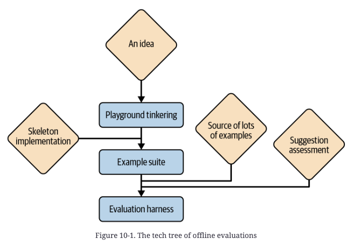

# Ch 10 — Evaluating LLM Applications

> Cross-pillar: this chapter's content maps to [06-eval](../../06-eval/README.md); it lives here because the book is filed under 01-prompt.

An evaluation framework is what lets you tell whether a change to model, prompt, or architecture is progress, noise, or regression. Build it before you build the app — it's the oldest, highest-leverage part of the GitHub Copilot codebase, older than the proxy, prompts, or UI.

## What are you even testing?

Evaluation can target three layers, corresponding to the loop of one application run (see Ch 4):
- **The model** — swap/upgrade decisions. Test across as large a regression span as possible, unless mixing models per-step for cost/latency, in which case test each pass in isolation.
- **Individual interactions (prompts)** — prompt/parameter tuning. Favor small unit tests of a single model pass; regression tests work too but statistical noise can drown out per-change effects.
- **How interactions compose (architecture)** — loop-shape decisions require regression tests by definition; there's no unit-level substitute.

If you can only build one harness, build one that covers the whole loop — reality is end-to-end, so that's what you ultimately optimize for. Add critical-path unit tests on top once the loop-level harness exists.

**Tip:** always record latency and token consumption in test runs — cheap to capture, useful for catching regressions unrelated to quality.

## Offline vs. online evaluation

- **Offline evaluation** — assessed against example cases independent of live runs; doesn't need real users or even a working app; typically the first evaluation you build.
- **Online evaluation** — tests directly on live users; higher stakes (a bad idea live can hurt UX) and needs enough users for a clean signal, but the data is maximally valid for your real use case.

## Offline evaluation: the tech tree

**1. Example suites** — the entry point. Three components:
- 5–20 example inputs spanning realistic scenarios
- A script that assembles each into your app's prompt, calls the model, and dumps prompt + completion to files
- A way to eyeball diffs (e.g., commit to git, review via `git diff`)

Not a test suite in the automated-pass/fail sense — you manually judge each diff as improvement or regression. Two advantages: (1) usable from your very first prompt draft, before any assessment method exists; (2) familiarity with the same examples across iterations builds intuition for the completion's typical failure modes, which then informs targeted prompt fixes. Example: GitHub PR summarization — eyeballing tens of mined example PRs let the team dial verbosity ("too terse" → add "detailed"; "too verbose" → cap at 1–2 paragraphs) and suppress unwanted content (e.g., asking for two paragraphs but only surfacing one, per the Ch 7 "fluff" trick).

Example suites don't scale past what you're willing to eyeball per change. Subtle effects need hundreds to thousands of examples — which requires solving two problems: sourcing examples, and automatically scoring solutions.

**2. Evaluation harness** — the scaled-up version, needs many examples plus an automatic scoring method.

*Multi-turn / interactive loops* (e.g., conversations) complicate both. Two evaluation strategies:
- **Canned conversations**: script a fixed dialogue; at each turn, evaluate the model's response to that turn regardless of what it actually said, then move to the next scripted turn as if the model had said the canned line. Isolates each turn's quality but never tests compounding errors.
- **LLM-mocked user**: give the model a user profile (like improv instructions) and let it play the user's side, testing the whole loop end-to-end — at the cost of baking in the mocking model's own misunderstandings/biases about how users behave.

## Finding samples

Three sources, in order of typical availability:

1. **Existing records** — mine real-world data that solves the same or a similar problem. Ideal when users already solved this problem without AI at scale (e.g., an "AI-prefill a form" feature could mine tens of thousands of human-filled forms). Balance ubiquity (must be common enough to scale) against similarity (must be close enough to your app's problem for valid conclusions) — a stepping stone between lab and reality.
   - Copilot example: no corpus of "what should the user type next" exists, but GitHub's open source corpus does. Synthesis procedure: take a repo → a file → a function → strip the function body (simulating an in-progress cursor position) → ask Copilot to complete it. Imperfect (function-body-length distribution skews long; later file edits like added imports aren't reflected) but near-infinite.

2. **App usage / telemetry** — realistic almost by definition, but: data doesn't exist pre-launch; major app updates can invalidate earlier data; telemetry requires high consent/handling/safeguarding standards; and captures great example *inputs* but not necessarily *gold-standard outputs* (what the user did after was influenced by what your app suggested). Best reserved for online evaluation.

3. **Synthetic (LLM-generated) examples** — works well when you can start from a solution and invent the problem backward, or when you just need situations (no gold standard required). Go hierarchical for coverage:
   - Ask the LLM for a topic list, or enumerate topic *aspects* yourself — n × m × l × k combinations from n, m, l, k options per aspect gives wide, well-distributed coverage cheaply.
   - For more samples than topics, ask the LLM for several examples per topic in one generation (wider variety than repeated temperature>0 calls).
   - Risk: if the LLM lacks command of the problem space, generated examples skew toward simplistic/exaggerated tropes or popular misconceptions. Bigger risk: if the same LLM both generates the test set and is a candidate under test (e.g., deciding whether to switch model A → B, with A having generated all samples), the evaluation is biased toward the generating model.

## Evaluating solutions

Three approaches, ordered by difficulty:

### 1. Gold standard matching
Compare against a trusted reference solution.
- **Simple case** (yes/no or classification output): just count match rate against gold labels. For statistical power, use logprobs (Ch 7).
- **Free-form text**: exact match becomes vanishingly rare as output freedom/length grows, and even then only tells you about stylistic conformity, not correctness. **Partial match metrics** fix this by isolating one dimension that matters (e.g., "exact match after stripping comments/whitespace" for code; "match on destination country only" for travel suggestions).
- **Choosing the aspect to match on** — pick one that satisfies both:
  - Distinguishes breaking vs. benign divergence from gold standard (validity)
  - Isn't so narrow the model has no realistic chance of hitting it, nor so broad the check is meaningless
  - Example: smart-home "I'm chilly" → gold standard sets heat to 77°F. Checking "did it touch the heating system at all" is the meaningful test — a wrong-but-sane temperature (like 74°F) is a much less likely/severe failure than not touching heating at all or touching the wrong system.
  - For structured/tool-calling outputs: test the *first* decision point with real risk of going wrong, since later decisions are invalidated once an earlier one fails. Sequence: tool-selected-at-all → correct-tool → correct-syntax → correct-parameter-values.

### 2. Functional testing
When no gold standard exists or comparison is impractical: check whether the output objectively "works" — parses cleanly, calls only available tools with correctly-typed arguments, compiles, passes existing unit tests. Copilot example: replay a function replacement from an open source repo, then check whether that repo's own unit test suite still passes against Copilot's suggested body (weaker fallback: check linter agreement). Often too weak alone, but sometimes goes surprisingly far since the domain provides its own test oracle.

### 3. LLM assessment
For wooly qualities (helpfulness, friendliness, tone) that resist objective scoring, use the LLM itself as judge — but naively asking the *same* model that generated the answer "is this correct?" injects strong bias, structurally like asking a student to grade their own essay.

**Key fix: never let the model know it's grading its own work.** Advice/critique conversations work best when the model believes it's grading a third party. Models get somewhat less accurate grading the user vs. a third party, but much worse grading *themselves* — self-grading collides with two opposing training biases: forum/comment-heavy pretraining data that isn't known for objective self-reflection, and RLHF-induced eagerness to defer/correct at the slightest hint of user doubt. Even where these balance on average, being pulled two directions at once degrades objectivity.

**Warning:** LLM assessment questions are usually phrased as absolute quality judgments ("is this correct?") but a priori only carry valid meaning as *relative* judgments ("version A is judged correct more often than B"). A standalone "81% correct" figure means little on its own.

### SOMA assessment framework
A structured recipe for LLM-as-judge that guards against ambiguity: **S**pecific questions, **O**rdinal scaled answers, **M**ulti-**A**spect coverage.

- **Specific questions**: avoid generic "is this right?" — for most tasks (excluding easily-verified formats like limericks), that question is nearly as hard for the LLM as generating the answer was, and may be *more* ambiguous, since "right" has multiple readings.
- **Ordinal scaled answers**: ditch yes/no. Ask for a rating on a scale (1–5 is a good default per psychometrics research), with an explicit description of what each level means — otherwise the model applies inconsistent or systematically biased standards run to run (e.g., holding "trying hard" answers to a higher bar than "good enough" ones).
- **Multi-aspect coverage**: a single "how good" question invites the model to silently switch which dimension it's judging on between examples (correctness of the value vs. whether to ask before acting vs. right tool choice). Fix: predefine categories and score each explicitly, then aggregate or pattern-match across them rather than trusting one composite number. Common default split — **intent** (did the model form the right plan?) vs. **execution** (did it correctly carry out that plan, e.g. right tool + syntax?). GitHub Copilot's chat-conversation scoring used a **relevance-truth-completeness (RTC)** variant of this. Avoid "Goldilocks" questions that conflate "enough" and "not too much" into one axis — split them.
- **Tip**: state the evaluation task and the aspects to grade *before* showing the example — the model reads once, forward-only, so front-loading the rubric lets it focus on the right things while reading.

**Grounding LLM judgment in humans**: LLM self-scaling assessment is meant to replace human annotation at scale without regressing quality — so validate it against a pool of *several* human annotators (never just one, since humans disagree with each other too). Confirm that inter-annotator disagreement (measured via e.g. Kendall's Tau) stays stable when you add the model — queried once, at temperature 0 — into the pool.

### Offline evaluation decision checklist
**Pick one source**: existing records (can you find plenty?) / app usage (is the data trickle fast enough, accounting for invalidation from app changes?) / synthetic examples (worth the synthesis effort?).
**Pick one test**: ground-truth match (is a full/partial match realistic and meaningful?) / functional test (can you isolate an automatable critical aspect?) / LLM assessment (are good and bad outputs recognizably different to people?).

## Online evaluation

Offline evaluation is inherently a lab simulation. Lab advantages: safe to fail, scales cheaply, available before launch. But live traffic is the only true test of real merit — actual users, actual stakes.

### A/B testing
Ship two (or a few) variants — A (usually status quo) and B (your candidate) — to random user splits, run for a while, compare on predefined metrics, then roll out the winner. Define success metrics (proxies for user satisfaction, e.g. acceptance rate) and guardrail metrics (proxies for catastrophic failure, e.g. error/complaint rate) *before* the test. Standard infra (Optimizely, VWO, AB Tasty) handles assignment and stats — the app just needs to run in either mode behind a flag. Client-side apps need a rollout of the new logic to (most) users before testing can even begin, which is itself a bottleneck.

**Tip:** online evaluation has less bandwidth than offline — finite users, slower signal — so be deliberate about which ideas you spend it testing (whittle down via offline evaluation first).

**Cohort caveat**: don't naively bucket "already-updated users" as group B and "everyone else" as group A — update timing correlates with behavior. Instead, only compare users after they've been randomly assigned; users who haven't yet updated simply don't participate in the analysis.

### Metrics (five kinds, most to least straightforward)

1. **Direct feedback** — explicit user signal: thumbs up/down, or ChatGPT's *contrastive feedback* ("Which is better?"). High-quality signal (also reusable as fine-tuning data) but intrusive — thumbs-up is rarely given for merely-solid output, so it skews toward capturing frustration more reliably than delight. Contrastive feedback is the clearest signal but the most intrusive; fine for an assistant users deliberately seek out, awkward for an ambient system (no one wants their smart-home system asking "how was that?" after every light adjustment). Delayed feedback is often more valuable than immediate — knowing after the fact that a suggested trip "kicked ass" (or "sucked") beats in-the-moment reaction.
2. **Functional correctness** — did it objectively work? Code compiles, ticket confirmed, program opened, email sent. Concrete and often binary, especially for small subtasks.
3. **User acceptance** — did the user take/keep the suggestion (book the trip, click the link)? Weaker than functional correctness alone (click-through only proves the suggestion *looked* promising) but often the most practically important signal — for Copilot, acceptance metrics correlated more strongly with reported productivity gains than more sophisticated impact measurements did.
4. **Achieved impact** — outcome-side signals answering the same "was it helpful" question from the other direction: "how much of the final email did the assistant write," "did the user who clicked the travel suggestion actually buy the ticket."
5. **Incidental metrics** — measurements with no unique tie to "goodness" but worth tracking anyway: latency (a fast bad suggestion is still worthless; a slow good one still has value), conversation length (ambiguous — could mean instant resolution or user rage-quitting). Track more of these rather than fewer as rough quality indicators and to catch/investigate unexpected shifts.

**Practical starting point**: look first for an acceptance or impact metric you can trust; fall back to direct feedback if none exists. Keep acceptance/impact metrics as ongoing guardrails regardless, plus functional-correctness and incidental metrics (especially latency and errors).

## Key takeaways

- Build evaluation *first* — it's what turns every subsequent change into a measured decision instead of a guess, and it's cheap relative to the leverage it buys.
- Offline eval = lab (cheap, safe, available pre-launch, artificial); online eval = live users (higher-stakes, slower, but the only fully valid signal). Use offline to whittle down candidates before spending scarce online bandwidth.
- The offline pipeline has two independent axes to solve: sourcing examples (existing records → app usage → synthetic) and scoring solutions (gold-standard match → functional test → LLM assessment), roughly in order of decreasing rigor and increasing flexibility.
- Never let an LLM judge grade its own output as if it were the author — frame it as evaluating a third party, and structure the prompt with SOMA (Specific questions, Ordinal scale, Multi-Aspect coverage) to prevent drifting, ambiguous self-assessment.
- Validate LLM-as-judge against several human annotators, not one — the bar is "doesn't increase disagreement beyond human-human baseline," not "perfect agreement."
- Online metrics range from noisy-but-honest (direct feedback) to clean-but-partial (functional correctness) to practically decisive (acceptance/impact) — acceptance often predicts real-world value better than more sophisticated impact scores.
