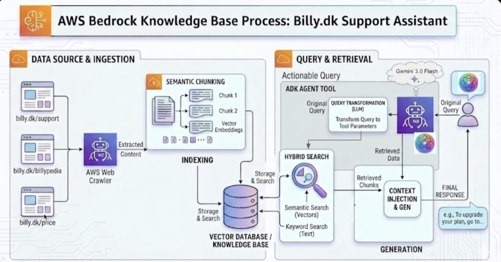
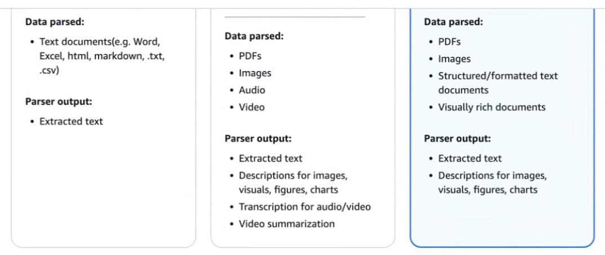

# 3 — Retrieval Strategies: Pre-Computed vs. Just-in-Time

> How content gets into the window. The biggest architectural shift in this pillar.

---

## The shift

The RAG-era assumption was: **retrieve before inference**. Embed the corpus, embed the query, pull top-k chunks, stuff them in the window, generate. All retrieval happens before the model does anything.

The agentic assumption is: **retrieve during inference**. Give the model tools and lightweight identifiers, and let it decide what to load, when, based on what it has learned so far. Anthropic calls this **just-in-time context**.

The difference is who decides relevance. Pre-computed retrieval makes an embedding-similarity guess about relevance *before seeing the model's reasoning*. Just-in-time lets relevance be determined by an agent that has already read the first file and now knows which one it actually needs.

---

## Just-in-time context

Instead of loading data, maintain **lightweight identifiers** and load at runtime:

- File paths
- Stored queries
- Web links
- Record IDs, table names
- Search commands

A file path costs ~10 tokens. The file costs 5,000. If the agent needs three of the fifty files a pre-retrieval step would have loaded, the identifier approach spends ~500 tokens on the index and 15,000 on the three files it actually reads — instead of 250,000 on all fifty.

**Progressive disclosure** is the behavioral pattern: the agent discovers relevant context incrementally through exploration, each read informing the next. It mirrors how a human engineer approaches an unfamiliar codebase — `ls`, then `grep`, then read the three files that matter. Nobody reads the repo front to back first.

Metadata carries signal for free. A path like `tests/integration/test_auth_retry.py` tells the agent about scope, purpose, and relationship before a single byte of content is read. Naming conventions are a retrieval optimization.

### Costs

Just-in-time is not free:

- **Latency.** Sequential tool calls are slower than one upfront retrieval. Each exploration round-trip is a full inference.
- **Wandering.** The agent can explore unproductively, burning context on the search itself rather than the answer.
- **Non-determinism.** Two runs may load different files, complicating evals and reproducibility.

---

## The hybrid strategy

The practical default. Pre-load what is cheap and near-certainly needed; leave the long tail to runtime exploration.

```
Pre-load (fixed cost, high hit rate)      Just-in-time (variable, long tail)
-----------------------------------      ---------------------------------
CLAUDE.md / project conventions          Any specific source file
Directory tree / file index              Full API reference sections
Schema summaries                         Historical records
Recently touched files                   Log output, test output
```

Claude Code is this pattern: `CLAUDE.md` loads every session; everything else is `Read`, `Grep`, `Glob` on demand.

**Design question that decides it:** *Is this needed on ≥80% of turns?* Yes → pre-load. No → identifier plus a tool to fetch it.

---

## Pre-retrieval pipeline

When you do retrieve upfront, the operations below compose in this order. Each stage narrows the candidate set, so cheap filters go first.

```
User Query
      ↓
Metadata Filtering       <- cheapest; drop by permission, date, source, tenant
      ↓
Vector Search            <- semantic top-k over what survived
      ↓
Context Ranking          <- rerank with a cross-encoder; send only top of rerank
      ↓
Deduplication            <- collapse near-identical chunks
      ↓
Compression              <- reduce each doc to what answers *this* query
      ↓
Memory Injection         <- add cross-session facts
      ↓
Structured Formatting    <- tag and delimit; never dump raw text
      ↓
LLM
```

Stage notes:

- **Metadata filtering first.** Permission checks and freshness filters are near-free compared to embedding search, and dropping candidates early makes every later stage cheaper. Push the filter *into* the vector query rather than applying it to the results — see the funnel under [a tuned production pipeline](#a-tuned-production-pipeline). Permission filtering here is also a security control, not just an optimization.
- **Ranking ≠ retrieval.** Bi-encoder vector search is fast and approximate; a cross-encoder reranker is slow and accurate. Retrieve wide, rerank, send narrow — order-of-magnitude k=50→5, though real numbers are corpus-specific.
- **Deduplication has a trap.** A chunk retrieved by multiple sub-queries is often the *most* relevant one, not redundant noise. Collapse duplicates but treat multi-retrieval as a positive ranking signal rather than a reason to discard.
- **Compression is query-conditional.** Reduce each document to the portion that answers the current question — not a generic summary. A generic summary discards the specific detail the query needed.
- **Structured formatting.** Wrap in tags with source attribution so the model can cite and so injected content stays distinguishable from instructions.

### A worked example

A production pipeline with the same shape — ingestion and indexing on the left, query and retrieval on the right:



Two things worth noting against the abstract pipeline above. **Hybrid search** runs semantic and keyword retrieval together rather than choosing between them — vectors catch paraphrase, keywords catch exact identifiers, and each covers the other's failure mode. And **query transformation** sits before retrieval: the user's original phrasing is rewritten into tool parameters, because the text a human types is rarely the text that retrieves best.

What the diagram omits is as informative as what it shows — there is no reranking stage and no deduplication, which is typical of a first production cut. Those are the stages teams add after retrieval quality plateaus.

### A tuned production pipeline

Bayer's PRINCE platform (see [03-harness/reliable-agents.md](../../03-harness/reliable-agents.md)) is the same pipeline after that plateau, with the numbers filled in. It retrieves over decades of preclinical study reports, and the query-time path runs:

1. **Keyword extraction and filter generation, concurrently.** One LLM pass pulls search keywords out of the natural-language query (domain terms like `piloerection`, `ataxia`); a second generates a structured metadata filter (`eq(study_id, T123456-2)`) via few-shot prompting over permutation examples.
2. **Query expansion, n=5.** A smaller, faster model rewrites the question into five semantically similar variants, covering phrasing and terminology drift.
3. **Metadata pre-filtering.** The generated filter is applied *inside* the vector database query, not after it — cutting the search space from millions of vectors to tens or hundreds before any similarity math runs.
4. **Parallel hybrid search, weighted 0.7/0.3.** Each of the five expanded queries runs its own hybrid search over the filtered space, combining kNN vector similarity (weight **0.7**) with keyword search (weight **0.3**). The split was found experimentally, not derived — it is a corpus-specific tuning result, and the right prior for a new corpus is "measure it," not "use 0.7."
5. **Aggregate and initially rank, k≈20.** Union the chunks across all five searches, score each by its *highest* weighted score across the parallel runs, keep the top ~20.
6. **Cross-encoder rerank, k=20 → 7.** A `bge-reranker-large` cross-encoder scores each candidate against the *original* question and keeps the top 7 as final context.

Three things generalize past the specific numbers:

- **Expansion multiplies retrieval, so the filter has to come first.** Five queries against an unfiltered corpus is five times the expensive search. Pre-filtering makes fan-out affordable — the ordering rule from the abstract pipeline is what makes the expansion tractable at all.
- **Max-score aggregation is a dedup policy.** Taking the highest score a chunk earned across parallel searches, rather than summing or averaging, treats multi-retrieval as a ranking signal without letting a chunk win by appearing everywhere weakly. It is the practical answer to the deduplication trap above.
- **The rerank scores against the original query, not the expanded ones.** Expansion is a recall device; the user's actual question is still the relevance target. Reranking against a rewrite would compound the rewrite's drift.

Note the funnel: millions → hundreds (filter) → ~20 (hybrid + aggregate) → 7 (rerank). Retrieve wide, rerank hard, send narrow — with each narrowing done by a mechanism more accurate and more expensive than the last.

### Text-to-SQL is a retrieval strategy

Vector search over chunks is the wrong tool for questions that need precise filtering, aggregation, or comparison — "give me 50 studies done on rat," or any numerical rollup. Embedding similarity does not count, sum, or compare. PRINCE routes these to a Text-to-SQL tool instead, and the context-engineering decisions inside it mirror the RAG path:

- **Schema subsetting.** Only the schema components relevant to the current query are injected, rather than the full database schema — the pre-filtering move applied to the prompt instead of the corpus.
- **Dynamic few-shot from a semantic layer.** Hand-picked (natural language → SQL) example pairs live in their own vector-database collection. The user's query retrieves the most similar examples, which go into the generation prompt as in-context learning. This is retrieval used to *condition generation* rather than to supply answer content, and it is the note's clearest case of the few-shot examples themselves being a retrieved, growable asset: new examples get added as failure patterns surface, and quality improves without retraining or prompt rewrites.
- **Validation over review.** Generated SQL is checked mechanically (SELECT-only; DELETE/INSERT/UPDATE blocked). An earlier LLM-review step was *removed* — it flagged valid queries as broken often enough to cost more than it saved. Deterministic validation beat model judgment on a task with a checkable answer.

The generalizable shape: a retrieval layer that spans structured and unstructured data needs a router, not a single index. The decision of *which* retrieval mechanism to use is itself a context-engineering decision, made before any retrieval happens.

### Ingestion determines the ceiling

Retrieval can only return what parsing extracted. Parser capability tiers roughly like this:



The consequence for context engineering: a tier-one parser over a PDF-heavy corpus silently drops every chart, diagram, and table into either nothing or garbled text. The retrieval layer then looks broken — low recall, irrelevant chunks — when the actual failure happened at ingestion. Check what the parser produced before tuning k, rerankers, or chunk size.

### Dynamic context windows

Scale retrieval depth to task complexity rather than using a fixed k:

| Task shape | Chunks |
|---|---|
| Simple factual lookup | few — more is pure dilution |
| Comparison / synthesis across sources | more — needs breadth |
| Ambiguous or exploratory | retrieve wide, rerank hard, send narrow |

Fixed k is a bug for both directions: it over-fills simple queries (rot) and under-fills complex ones (missing evidence).

---

## Hierarchical retrieval

For large corpora, retrieve in tiers: search summaries or section headers first, then fetch full content only for the sections that matched. This is just-in-time applied inside a pre-retrieval pipeline — the tier-1 index is the lightweight identifier.

---

## Caching

Two distinct caches, often confused:

- **Prompt caching** (inference-level) — caches the prefill computation for a token prefix. Prefix-match only, so ordering governs hit rate. See [02-context-anatomy.md](02-context-anatomy.md#ordering-stable-before-dynamic).
- **Retrieval caching** (application-level) — caches the *results* of expensive retrieval keyed by query similarity. A near-duplicate query reuses the prior result set instead of re-running search, planning, or sub-query generation. Cuts cost and latency on hot queries.

---

## Context validation

Retrieved content is not trustworthy by default. Validate before injecting:

- Remove outdated documents (freshness threshold)
- Enforce permissions — never surface content the requester cannot access
- Detect conflicting information across sources; surface the conflict rather than silently picking one
- Verify citations resolve to real, retrievable sources

Conflict detection matters most. Two retrieved documents contradicting each other, both injected silently, is a reliable path to a confidently wrong answer. This is **context clash** — see [07-context-failure-modes.md](07-context-failure-modes.md).

---

## Working reference

`~/.claude/refs/agent-context.md` — the Select lever. `~/.claude/refs/agent-tools.md` — tool design determines whether just-in-time retrieval is viable; a tool returning 50k tokens of raw output defeats the purpose. See [06-multi-agent-context.md](06-multi-agent-context.md) for token-efficient tool design.

---

→ Next: [04-compression-compaction.md](04-compression-compaction.md) — what to do when the window fills anyway.
